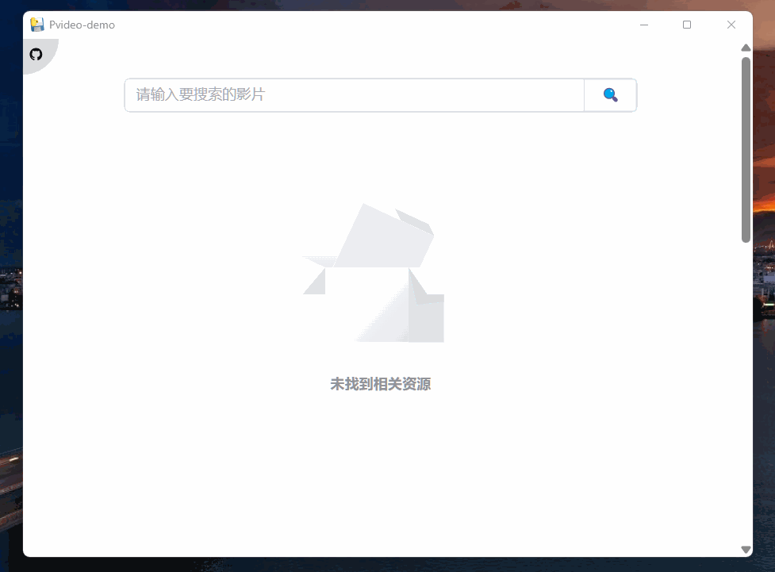
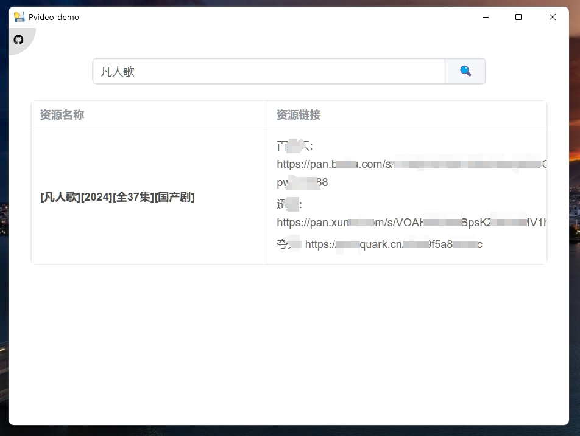

# 影视资源 GUI 应用

## 🥳Contributors

- Original Author: [SmallTeddy](https://github.com/SmallTeddy)
- Original Repo: [video-resource](https://github.com/SmallTeddy/video-resource)
- Modified By: [Sinvon](https://github.com/isinvon)

## ⚠️ 免责声明

> 尊重版权：确保不侵犯任何版权内容，只爬取公开可用的资源。

该项目仅供学习和研究使用，不得用于商业或非法用途。在使用网络爬虫时，请确保遵守目标网站的`robots.txt`文件规定，尊重版权和隐私政策，不要对网站服务器造成不必要的负担。

## 🔧 项目概述

本项目旨在使用爬虫技术爬取公开可用的影视资源信息。通过此项目，学习者可以了解网络爬虫的基本原理、如何解析 HTML 页面以及如何以结构化的方式存储数据。

## 🖼️ 运行显示

<!-- 图片显示 -->




## 🫶 安装方式

<font color="#83a57a">
在 🔗 <a href="https://github.com/isinvon/Pvideo-demo/releases">Release</a> 中下载最新版本即可。
</font>

## 🛠️ 运行前所需环境

### 1、python 环境

- python 3.x
- pip（python 包管理器）
- pywebview （用于构建桌面简易应用）
- pyinstaller （用于打包成 exe）
- subprocess （用于执行 shell 命令）

### 2、vue 环境

- nodejs（用于构建前端）
- vue-cli（用于构建前端）
- element-plus（前端 UI 组件库）
- @iconify/vue（前端图标库）

### 3、安装依赖

构建 python 虚拟环境

```bash
python -m venv .venv
```

激活 python 虚拟环境(windows)

```bash
.venv\Scripts\activate
```

激活 python 虚拟环境(linux/macos)

```
source venv/bin/activate
```


安装依赖

```bash
pip install -r requirements.txt
```

接着安装 vue 项目的依赖

```bash
pnpm install
```

## ⚙️ 运行项目

### 1、运行 python

```bash
pnpm run py-run
```

或者

```bash
python main.py
```

### 2、运行 vue

```bash
pnpm run vue-run
```

### 3、也可以 python 和 vue 同时运行

```bash
pnpm run py-vue-run
```

## 🍃 只构建 vue 项目

```bash
pnpm run vue-build
```

## 🦄 构建并打包

### 1、构建打包成 exe (需要 windows 系统)

```bash
pnpm run py-vue-build-exe
```

### 2、构建打包成 dmg 或者 app (需要 macOS 系统)

dmg:

```bash
pnpm run py-vue-build-dmg
```

app:

```bash
pnpm run py-vue-build-app
```

之后就可以在 output 的文件夹中找到打包好的 exe、dmg\app 文件了，双击启动即可。
